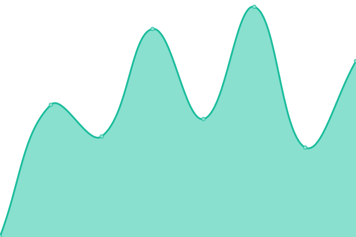

# [📈 Live Status](https://wshen001.github.io/monitor): <!--live status--> **🟥 Complete outage**

This repository contains the open-source uptime monitor and status page for [Hu](https://wshen001.github.io/monitor), powered by [Upptime](https://github.com/upptime/upptime).

With [Upptime](https://upptime.js.org), you can get your own unlimited and free uptime monitor and status page, powered entirely by a GitHub repository. We use [Issues](https://github.com/wshen001/monitor/issues) as incident reports, [Actions](https://github.com/wshen001/monitor/actions) as uptime monitors, and [Pages](https://wshen001.github.io/monitor) for the status page.

<!--start: status pages-->
<!-- This summary is generated by Upptime (https://github.com/upptime/upptime) -->
<!-- Do not edit this manually, your changes will be overwritten -->
<!-- prettier-ignore -->
| URL | Status | History | Response Time | Uptime |
| --- | ------ | ------- | ------------- | ------ |
|  API | 🟥 Down | [api.yml](https://github.com/wshen001/monitor/commits/HEAD/history/api.yml) | 

 243ms
     
 | 

<a href="https://wshen001.github.io/monitor/history/api">0.00%</a>
    

|  API DEV | 🟥 Down | [api-dev.yml](https://github.com/wshen001/monitor/commits/HEAD/history/api-dev.yml) | 

 253ms
     
 | 

<a href="https://wshen001.github.io/monitor/history/api-dev">0.00%</a>
    

|  ResourceSpace | 🟥 Down | [resource-space.yml](https://github.com/wshen001/monitor/commits/HEAD/history/resource-space.yml) | 

 244ms
     
 | 

<a href="https://wshen001.github.io/monitor/history/resource-space">0.00%</a>
    

|  Only Office | 🟥 Down | [only-office.yml](https://github.com/wshen001/monitor/commits/HEAD/history/only-office.yml) | 

 238ms
     
 | 

<a href="https://wshen001.github.io/monitor/history/only-office">0.00%</a>
    

|  NCDB | 🟥 Down | [ncdb.yml](https://github.com/wshen001/monitor/commits/HEAD/history/ncdb.yml) | 

 248ms
     
 | 

<a href="https://wshen001.github.io/monitor/history/ncdb">0.00%</a>
    

|  Kibana | 🟥 Down | [kibana.yml](https://github.com/wshen001/monitor/commits/HEAD/history/kibana.yml) | 

 228ms
     
 | 

<a href="https://wshen001.github.io/monitor/history/kibana">0.00%</a>
    

<!--end: status pages-->

[**Visit our status website →**](https://wshen001.github.io/monitor)

## 📄 License

- Powered by: [Upptime](https://github.com/upptime/upptime)
- Code: [MIT](./LICENSE) © [Hu](https://wshen001.github.io/monitor)
- Data in the `./history` directory: [Open Database License](https://opendatacommons.org/licenses/odbl/1-0/)
